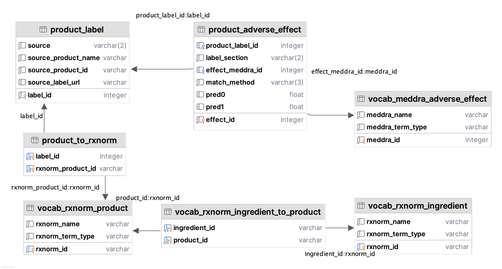

# OnSIDES

## Table of Contents

- [Introduction](#introduction)
- [Downloading the Data](#downloading-the-data)
- [Loading into a database](#loading-the-data-into-the-database)
- [Database design and organization](#database-design-and-organization)
- [Data generation and metrics](#data-generation-and-metrics)
- [Developer documentation](#developer-documentation)
- [Limitations](#limitations)
- [Contact](#contact)

---

## Introduction

OnSIDES is an international, comprehensive database of drugs and their adverse events using data from drug product labels.
Information was extracted by fine-tuning a [PubMedBERT language model](https://huggingface.co/microsoft/BiomedNLP-PubMedBERT-base-uncased-abstract) on 200 manually curated labels available from [Denmer-Fushman et al.](https://pubmed.ncbi.nlm.nih.gov/29381145/).
This comprehensive database will be updated quarterly, and currently contains more than 7.1 million drug-ADE pairs for 4,097 drug ingredients extracted from 51,460 labels, processed from all of the labels available to download from [DailyMed (USA)](https://dailymed.nlm.nih.gov/dailymed/spl-resources-all-drug-labels.cfm), [EMA (EU)](https://www.ema.europa.eu/en/medicines), [EMC (UK)](https://www.medicines.org.uk/emc), and [KEGG (Japan)](https://www.kegg.jp/kegg/drug/) as of April 2025.

### Citation

If you use the OnSIDES database, results, or methods in your work, please reference [our paper](https://doi.org/10.1016/j.medj.2025.100642):

>Tanaka Y, Chen HY, Belloni P, Gisladottir U, Kefeli J, Patterson J, Srinivasan A, Zietz M, Sirdeshmukh G, Berkowitz J, LaRow Brown K, Tatonetti NP. OnSIDES database: Extracting adverse drug events from drug labels using natural language processing models. Med. 2025 Mar 27:100642. doi: 10.1016/j.medj.2025.100642. PMID: 40179876.

---

## Downloading the data

OnSIDES is released as a set of flat files (comma-separated) and as an interactive dataset at [onsidesdb.org](https://onsidesdb.org).
Downloads are available in the [Releases](https://github.com/tatonetti-lab/onsides/releases) section.

---

## Loading into a database

We provide utilities to simplify loading OnSIDES into a relational database of your choice (e.g. MySQL, PostgreSQL, etc.).
We have pre-built database schema files for [MySQL](database/schema/mysql.sql), [PostgreSQL](database/schema/postgres.sql), and [SQLite](database/schema/sqlite.sql), along with example bash scripts to create a database and load the files in the proper order ([MySQL](database/mysql.sh), [PostgreSQL](database/postgres.sh), and [SQLite](database/sqlite.sh)).
These example scripts use [Podman](https://podman.io/) to run the databases in containers, but they can be easily adapted to work with existing databases.
We also provide OnSIDES as a single, pre-built SQLite database, which you could import into a database with specialized tools like [pgloader](https://pgloader.readthedocs.io/en/latest/ref/sqlite.html) or [sqlite3-to-mysql](https://github.com/techouse/sqlite3-to-mysql).

---

## Database Design and Organization

The OnSIDES database has the following seven tables:

1. `product_label` - Individual drug products
2. `product_adverse_effect` - Extracted adverse effects for drug products
3. `product_to_rxnorm` - Mapping from drug products to RxNorm products (many-to-many)
4. `vocab_rxnorm_product` - RxNorm products
5. `vocab_rxnorm_ingredient_to_product` - Mapping from RxNorm products to RxNorm ingredients (many-to-many)
6. `vocab_rxnorm_ingredient` - RxNorm ingredients
7. `vocab_meddra_adverse_effect` - MedDRA adverse effect terms

Tables starting with `product_` contain data from drug labels, while `vocab_` tables contain vocabulary mapping information from the [UMLS Metathesaurus](https://www.nlm.nih.gov/research/umls/knowledge_sources/metathesaurus/index.html) and the OMOP vocabularies (from [Athena](https://athena.ohdsi.org/)).

Here's a diagram of the database schema:




### High confidence set

In addition to this, there is one additional CSV file called `high_confidence.csv`.
This file contains ingredient-adverse effect pairs that were observed in all four sources (US, UK, EU, Japan).
We found 562,281 high-confidence ADEs across 5761 ingredients and 733 effects.

Since this table is derived, it has not been included in the database schemas.
A suitable definition (SQLite here) would be:

```sql
CREATE TABLE high_confidence (
    ingredient_id TEXT,
    effect_meddra_id INTEGER,
    FOREIGN KEY(ingredient_id) REFERENCES vocab_rxnorm_ingredient(rxnorm_id),
    FOREIGN KEY(effect_meddra_id) REFERENCES vocab_meddra_adverse_effect(meddra_id)
);
```

After creating the table, import as follows (SQLite again):
```
.mode csv
.import --skip 1 'csv/high_confidence.csv' high_confidence
```

### Manual annotations

As part of the v3.0.0 release and on, we include a set of manual annotations for download as well.
For more information, see the [annotation description](database/annotations/README.md).

---

## Data Generation and Metrics

OnSIDES is generated through the following steps:

1. Find and download drug labels for all human prescription drugs from four sources (DailyMed, EMA, EMC, KEGG).
2. Parse raw formats (e.g. PDF, XML), extract relevant sections, and format all label texts.
3. Identify string matches of MedDRA terms in the extracted label texts (note, MedDRA Japan for Japanese labels).
4. (Non-Japan): Apply PubMedBERT to score each matched term, and apply a cutoff threshold on the predictions.
5. Map all drug products to RxNorm.
6. Gather extracted data into a database (products, adverse effects identified). Combine with product-to-ingredient information from RxNorm and MedDRA concept mappings.
7. Validate the database, and export tables as flat files.

---

## Model accuracy

The fine-tuned PubMedBERT model used for OnSIDES achieved the following performance on 200 manually annotated FDA labels:

| Section   |       F1 |   Precision |   Recall |    AUROC |     N |
|:----------|---------:|------------:|---------:|---------:|------:|
| Boxed Warning        | 0.964 |    0.971 | 0.957 | 0.977  |   686 |
| Warnings and Precautions        | 0.882  |    0.883 | 0.881 | 0.933 | 10254 |
| Adverse Reactions        | 0.935 |    0.946 | 0.924 | 0.956 | 12122 |


In a separate comparison, this modeling approach was compared to the TAC 2017 dataset, and achieved the following performance:

**Performance metrics evaluated against the TAC gold standard**

| Metric      | TAC (Best Model<sup>†</sup>) | SIDER 4.1 | OnSIDES v1.0.0 | OnSIDES v2/3.0.0 |
| ----------- | ---------------------------- | --------- | -------------- | -------------- |
| F1 Score    | 82.19                        | 74.36     | 82.01          | **87.54**      |
| Precision   | 80.69                        | 43.49     | 88.76          | **91.29**      |
| Recall      | **85.05**                    | 52.89     | 77.12          | 84.08          |


---

## Developer Documentation

### Dependencies

[Install nix](https://determinate.systems/nix-installer/).

If you prefer not to use nix, you'll need to install all the dependencies yourself, including Python (I recommend [uv](https://docs.astral.sh/uv/)), [Java](https://java.com), [tabula](https://tabula.technology/), [pandoc](https://pandoc.org/), and [DuckDB](https://duckdb.org/), then create the virtual environment for Python (e.g. `uv sync`).

### Building

```bash
nix develop
snakemake -s snakemake/us/download/Snakefile
snakemake -s snakemake/uk/download/Snakefile
snakemake -s snakemake/eu/download/Snakefile
snakemake -s snakemake/jp/download/Snakefile
snakemake -s snakemake/us/parse/Snakefile
snakemake -s snakemake/uk/parse/Snakefile
snakemake -s snakemake/eu/parse/Snakefile
snakemake -s snakemake/jp/parse/Snakefile
snakemake -s snakemake/onsides/evaluate/Snakefile
snakemake -s snakemake/onsides/export/Snakefile
```

This project uses [Snakemake](https://snakemake.readthedocs.io/en/stable/index.html) to reproducibly download and build the database.
Snakemake is a workflow management tool that ensures work is not unnecessarily duplicated.
Various steps are stored as `Snakefile`s, in the `snakemake` directory.

By default, the first rule in a file is run.
Each file's first rule is a catch-all rule called `all`.
To run a Snakefile, ensure it's installed (e.g. `nix develop` or install manually), then run e.g. `snakemake -s snakemake/us/download/Snakefile`.
Adding `-n` makes it a dry run, meaning it tells you what it *would* do, without actually doing it.
Because Snakefiles can overwrite things, I recommend an initial dry run before running any other command, just to verify that you want it to do is what it will do.

The `snakemake` directory is organized as follows, with each sub-directory having a `Snakefile` and any additional scripts that are needed.
You should run these `Snakefile`s from the project root directory.

```
snakemake
├── eu
│   ├── download
│   └── parse
├── jp
│   ├── download
│   └── parse
├── onsides
│   ├── evaluate
│   └── export
├── uk
│   ├── download
│   └── parse
└── us
    ├── download
    └── parse
```

To run everything, you'll want to download each source, then parse, then evaluate (`onsides/evaluate`), then export (`onsides/export`).

To be transparent, the reason I didn't package everything into a single command is because these scripts will inevitably become stale in various ways (source URLs change, etc.), and this makes debugging significantly easier for the inheritors of this project.


### Releasing

Once everything above has been run, create the final release ZIP archive.
Here's how the v3.1.0 archive was created.

```bash
build-zip --version v3.1.0
```

---

## Limitations

OnSIDES is **strictly** intended for academic research purposes.
The adverse drug event term extraction method is far from perfect - some side effects will be missed and some predicted as true adverse events will be incorrect.

**Patients/healthcare professionals seeking health information should not trust or use this data, and instead refer to the information available from their regions' respective drug regulatory agencies, such as the [FDA](https://www.fda.gov/) (USA), [EMA](https://www.ema.europa.eu/en) (EU), [MHRA](https://www.gov.uk/government/organisations/medicines-and-healthcare-products-regulatory-agency) (UK), [PMDA](https://www.pmda.go.jp/english/) (Japan) and consult their healthcare providers for information.**

Additionally, this project is under active development.
We are continuing to further conduct independent validation of the performance of the models used, and improve the extraction methodology.
As such, the data, methods, and statistics are subject to change at any time.
Any updates to the database will be reflected on this page/in this repository.

---

## Contact

If you would like to contribute to this project or have any suggestions on how the methods, data, or evaluation can be improved please reach out to Dr. Tatonetti via [email](https://tatonettilab.org/people/) or [Twitter](http://twitter.com/nicktatonetti).
